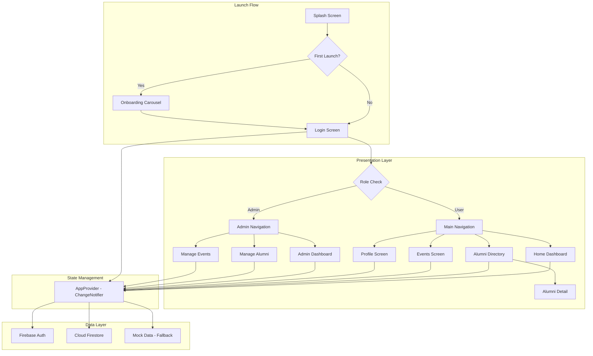
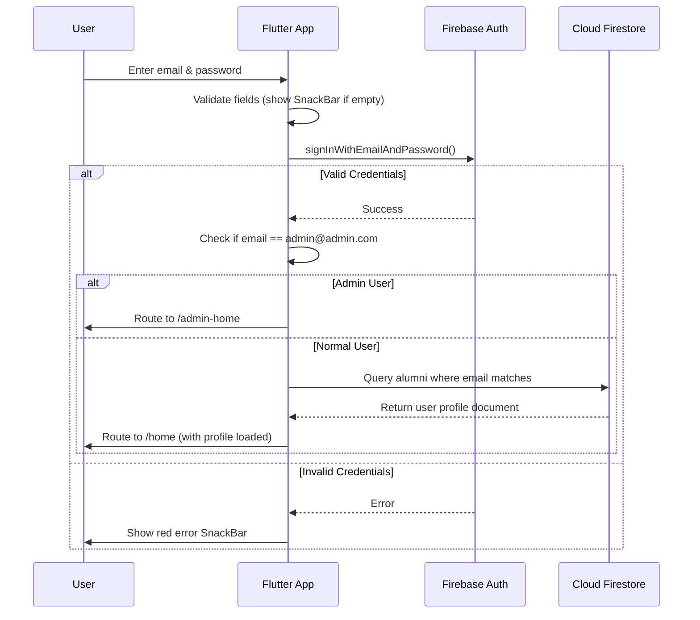
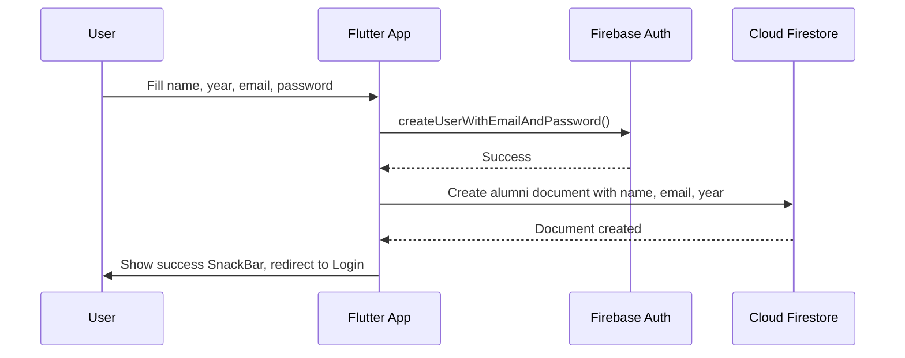
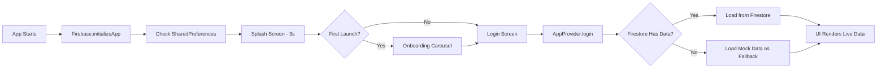
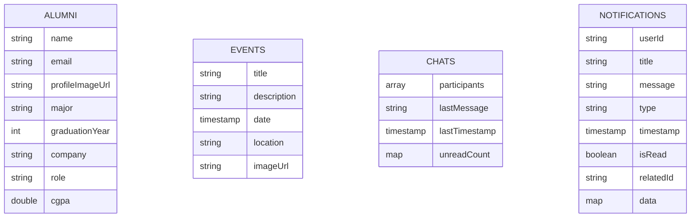

# Alumni Connect

A premium, feature-rich Alumni networking mobile application built with **Flutter** and **Firebase**. Designed for university alumni to stay connected, discover peers, and attend events — with a dedicated **Admin Dashboard** for management.

---

## Table of Contents

- [Alumni Connect](#alumni-connect)
  - [Table of Contents](#table-of-contents)
  - [Features](#features)
    - [User Features](#user-features)
    - [Admin Features](#admin-features)
    - [Notifications System](#notifications-system)
  - [Architecture](#architecture)
  - [Authentication Flow](#authentication-flow)
    - [Registration Flow](#registration-flow)
  - [Data Flow](#data-flow)
  - [Tech Stack](#tech-stack)
  - [Project Structure](#project-structure)
  - [Firestore Schema](#firestore-schema)
    - [Collection: `alumni`](#collection-alumni)
    - [Collection: `events`](#collection-events)
    - [Collection: `chats`](#collection-chats)
    - [Sub-collection: `chats/{chatId}/messages`](#sub-collection-chatschatidmessages)
    - [Collection: `notifications`](#collection-notifications)
  - [Getting Started](#getting-started)
    - [Prerequisites](#prerequisites)
    - [Installation](#installation)
    - [Setting Up Users](#setting-up-users)
    - [Admin Access](#admin-access)
  - [Notifications \& Messaging System](#notifications--messaging-system)
    - [Overview](#overview)
    - [Key Features](#key-features)
    - [Creating Notifications](#creating-notifications)
    - [Push Notifications (Future Enhancement)](#push-notifications-future-enhancement)
  - [License](#license)
  - [Contributing](#contributing)
  - [Support](#support)

---

## Features

### User Features
| Feature | Description |
|---|---|
| **Splash Screen** | Animated branded launch screen with logo fade-in and smooth transition |
| **Onboarding Carousel** | 3-slide first-launch intro (Connect, Discover, Grow) with skip option |
| **Login & Registration** | Secure Firebase Email/Password authentication with error SnackBars |
| **Auto Profile Creation** | Registration automatically creates a Firestore alumni profile |
| **Home Dashboard** | Personalized greeting, quick actions, upcoming events with shimmer loading |
| **Unread Notifications** | Real-time badge showing count of unread system notifications |
| **Unread Messages** | Real-time badge showing count of unread chat messages |
| **Notification Panel** | Draggable bottom sheet displaying recent notifications with type-based icons |
| **Alumni Directory** | Search by name/company/major + filter chips by major + pull-to-refresh |
| **Alumni Profile Detail** | Detailed view with Hero transition, CGPA display, and message button |
| **Messaging System** | One-on-one chat with real-time unread count tracking |
| **Events & News** | Visual event cards with RSVP functionality |
| **My Profile** | Dynamically loaded profile from Firestore based on logged-in user |
| **Dark Mode** | Full dark theme toggle from the Profile screen |
| **Proper Sign Out** | Firebase session cleared on logout |

### Admin Features
| Feature | Description |
|---|---|
| **Admin Dashboard** | System overview with live alumni/event counts and recent activity |
| **Unread Notifications** | Real-time badge showing system notifications for admin |
| **Support Messages** | Badge showing unread support messages from alumni |
| **Support Inbox** | View all alumni support conversations with unread counts |
| **Manage Alumni** | Add new alumni via dialog, delete with confirmation — all synced to Firestore |
| **Manage Events** | Add new events via dialog, delete with confirmation — all synced to Firestore |
| **Role-Based Routing** | `admin@admin.com` auto-routes to the admin panel |

### Notifications System
| Feature | Description |
|---|---|
| **Real-Time Notifications** | Firebase Firestore streams for instant notification updates |
| **Notification Types** | Support for message, event, alert, and system notifications |
| **Mark as Read** | Individual or bulk-mark notifications as read |
| **Color-Coded Icons** | Different notification types displayed with distinct colors and icons |
| **Timestamp Formatting** | Human-readable relative timestamps (just now, 1h ago, etc.) |
| **Notification Routing** | Tap notifications to navigate to related content (messages, events) |

---

## Architecture



---

## Authentication Flow



### Registration Flow



---

## Data Flow



---

## Tech Stack

| Technology | Purpose |
|---|---|
| **Flutter** | Cross-platform mobile framework |
| **Dart** | Programming language |
| **Firebase Auth** | User authentication |
| **Cloud Firestore** | NoSQL cloud database |
| **Provider** | State management |
| **GoRouter** | Declarative routing |
| **Google Fonts** | Premium typography (Plus Jakarta Sans) |
| **Lucide Icons** | Modern icon set |
| **Shimmer** | Skeleton loading animations |
| **Flutter Staggered Animations** | List entrance animations |
| **SharedPreferences** | Onboarding persistence |

---

## Project Structure

```
lib/
├── main.dart                          # Entry point: Firebase init, splash, onboarding
├── firebase_options.dart              # Auto-generated Firebase config
│
├── data/
│   ├── app_provider.dart              # State management, auth, CRUD, theme toggle
│   └── mock_data.dart                 # Fallback mock data
│
├── models/
│   ├── alumni_model.dart              # Alumni model (fromMap/toMap)
│   ├── event_model.dart               # Event model (fromMap/toMap)
│   ├── message_model.dart             # Message model for chat system
│   └── notification_model.dart        # Notification model for alerts/messages
│
├── router/
│   └── app_router.dart                # GoRouter configuration
│
├── screens/
│   ├── splash_screen.dart             # Animated branded splash
│   ├── onboarding_screen.dart         # 3-slide first-launch carousel
│   ├── login_screen.dart              # Login with error SnackBars
│   ├── registration_screen.dart       # Registration + auto Firestore profile
│   ├── main_navigation_bar.dart       # User bottom navigation
│   ├── home_dashboard.dart            # Home with unread messages/notifications
│   ├── notification_panel.dart        # Draggable notification drawer
│   ├── chat_screen.dart               # One-on-one messaging interface
│   ├── alumni_directory.dart          # Search, filter chips, pull-to-refresh
│   ├── alumni_profile_detail.dart     # Detail view with Hero transitions
│   ├── events_screen.dart             # Events feed with RSVP
│   ├── profile_screen.dart            # Dynamic profile + dark mode toggle
│   └── admin/
│       ├── admin_navigation_bar.dart  # Admin bottom navigation
│       ├── admin_dashboard.dart       # Admin overview with notifications
│       ├── manage_alumni_screen.dart   # Add/Delete alumni via Firestore
│       └── manage_events_screen.dart   # Add/Delete events via Firestore
│
├── theme/
│   └── app_theme.dart                 # Light + Dark theme definitions
│
└── widgets/
    └── custom_text_field.dart         # Reusable styled text input
```

---

## Firestore Schema



### Collection: `alumni`
| Field | Type | Example |
|---|---|---|
| `name` | string | `"John Doe"` |
| `email` | string | `"johndoe@example.com"` |
| `profileImageUrl` | string | `"https://i.pravatar.cc/150"` |
| `major` | string | `"Computer Science"` |
| `graduationYear` | number (int64) | `2024` |
| `company` | string | `"Google"` |
| `role` | string | `"Software Engineer"` |
| `cgpa` | number (double) | `3.8` |

### Collection: `events`
| Field | Type | Example |
|---|---|---|
| `title` | string | `"Annual Tech Mixer"` |
| `description` | string | `"An evening of networking..."` |
| `date` | timestamp | *(pick from calendar)* |
| `location` | string | `"Main Campus"` |
| `imageUrl` | string | `"https://images.unsplash.com/..."` |

### Collection: `chats`
| Field | Type | Example |
|---|---|---|
| `participants` | array | `["user1@email.com", "user2@email.com"]` |
| `lastMessage` | string | `"Hey, how are you?"` |
| `lastTimestamp` | timestamp | *(auto-generated)* |
| `unreadCount` | map | `{"user1@email.com": 2, "user2@email.com": 0}` |

### Sub-collection: `chats/{chatId}/messages`
| Field | Type | Example |
|---|---|---|
| `sender` | string | `"user1@email.com"` |
| `senderName` | string | `"John Doe"` |
| `text` | string | `"Hello there!"` |
| `timestamp` | timestamp | *(auto-generated)* |
| `isRead` | boolean | `true` |

### Collection: `notifications`
| Field | Type | Example |
|---|---|---|
| `userId` | string | `"user123"` or `"admin"` |
| `title` | string | `"New Message from John"` |
| `message` | string | `"Hello, how are you?"` |
| `type` | string | `"message"` / `"event"` / `"alert"` / `"system"` |
| `timestamp` | timestamp | *(auto-generated)* |
| `isRead` | boolean | `false` |
| `relatedId` | string | `"chat123"` or `"event456"` *(optional)* |
| `data` | map | `{"chatId": "chat123", "senderName": "John"}` *(optional)* |

---

## Getting Started

### Prerequisites
- Flutter SDK (3.11+)
- Firebase CLI (`npm install -g firebase-tools`)
- A Firebase project with **Authentication** and **Firestore** enabled
- Windows Developer Mode enabled (required for Firebase symlinks)

### Installation

```bash
# 1. Clone the repository
git clone <repo-url>
cd "Alumni Connect"

# 2. Install dependencies
flutter pub get

# 3. Configure Firebase (if not already configured)
dart pub global activate flutterfire_cli
flutterfire configure --project=<your-firebase-project-id>

# 4. Run the app
flutter run
```

### Setting Up Users

1. Go to **Firebase Console > Authentication > Users**
2. Add an admin user: `admin@admin.com` with a secure password
3. Add alumni users (e.g., `johndoe@example.com`) — or use the in-app Registration screen
4. Go to **Firestore Database** and add/verify documents in the `alumni` collection matching those emails

### Admin Access
- Login with `admin@admin.com` to access the Admin Dashboard
- Admin can add/delete alumni and events directly from the app

---

## Notifications & Messaging System

### Overview
Alumni Connect includes a real-time notifications and messaging system powered by Firebase Firestore streams. Both alumni and admin users receive instant notifications about new messages, events, and system alerts.

### Key Features
- **Real-time Updates**: Notifications and message counts update instantly using Firestore streams
- **Unread Badges**: Display unread message and notification counts in the app bar
- **Dashboard Summary**: Quick view cards showing unread messages and notifications
- **Notification Panel**: Draggable bottom sheet with recent notifications
- **Type-Based Routing**: Tap notifications to navigate to related content
- **Mark as Read**: Mark individual or all notifications as read

### Creating Notifications
Admins can programmatically create notifications using the AppProvider methods:

```dart
// Send a message notification
await provider.sendMessageNotification(
  recipientId: 'user123',
  senderName: 'John Doe',
  message: 'Hello, how are you?',
  chatId: 'chat123',
);

// Send an event notification to all alumni
await provider.sendEventNotification(
  eventName: 'Tech Mixer 2026',
  eventDetails: 'Annual networking event',
  eventId: 'event123',
);

// Send a custom notification
await provider.createNotification(
  userId: 'user123',
  title: 'Welcome to Alumni Connect',
  message: 'Start connecting with alumni today',
  type: 'system',
);
```

### Push Notifications (Future Enhancement)
The notification system is prepared for FCM (Firebase Cloud Messaging) integration for push notifications to mobile devices.

---

## License

This project is licensed under the **MIT License** — see the [LICENSE](LICENSE) file for details.

---

## Contributing

Contributions are welcome! Please feel free to submit a Pull Request.

## Support

For questions or issues, please open a GitHub issue.